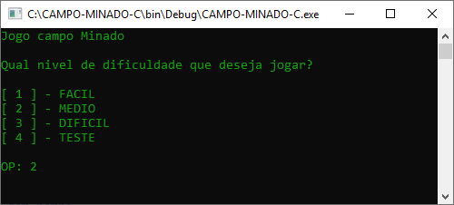
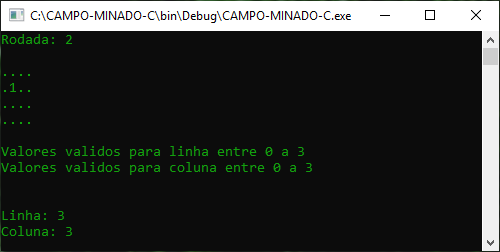
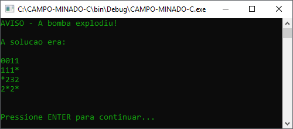

# Campo Minado C

Implementação em linguagem C do jogo do campo minado, contendo níveis de dificuldades e modo teste que revela as posições das minas. Para mais informações acesso o arquivo :pencil: `ENUNCIADO.pdf`.

# Execução

Pré-requisito

- Compilador linguagem C revisão C11 ou superior.

Para maior comodidade está  anexado na pasta ​"source"​ o projeto do repositório na IDE [Code::Blocks](codeblocks.org) em `campo-minado-c.cbp`.​​

# Screenshot

