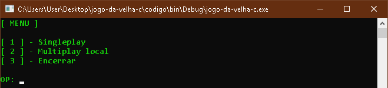

# Jogo da Velha C

Este software é um jogo da velha trivial implementado na linguagem C, permite o usuário jogar sozinho contra o computador (nunca é vencido, apenas empata) ou com outro jogador localmente. A interação é realizada pelo terminal.

# Execução

Pré-requisito

- Compilador linguagem C revisão C11 ou superior.

Para maior comodidade está  anexado na pasta ​"source"​ o projeto do repositório na IDE [Code::Blocks](codeblocks.org) em `jogo-da-velha-c.cbp`.​​

# Print de Execução

