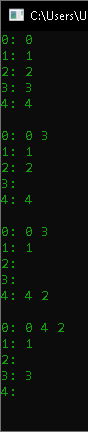

# Mundo dos Blocos C

Repositório criado para cumprir a realização da atividade acadêmica, que envolve manipulação e alocação de lista encadeadas. Para mais informações acesso o arquivo :pencil: `ENUNCIADO.pdf`.

# Execução

Pré-requisito

- Compilador linguagem C revisão C11 ou superior.

Para maior comodidade está  anexado na pasta ​"source"​ o projeto do repositório na IDE [Code::Blocks](codeblocks.org) `mundo-dos-blocos-c.cbp`.​​

No projeto `*.cbp` está definido por padrão os argumentos de linha de comando como: 

`arqv1.txt saida.txt -p`.

# Arquivo de entrada

O conteúdo do `arqv1.txt` é:

```
5
move 3 onto 0
move 2 over 4
pile 4 onto 0
quit
```

# Print de Execução

