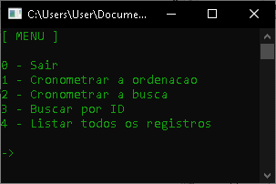
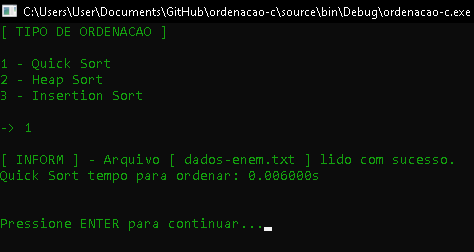

# Ordenação C

Repositório criado para cumprir a atividade acadêmica que envolve análise de ordenação de dados. Para mais informações acesso o arquivo :pencil: `ENUNCIADO.pdf`.

Métodos de ordenação avaliados:

- Quick Sort
- Heap Sort
- Insert Sort

# Execução

Pré-requisito

- Compilador linguagem C revisão C11 ou superior.

Para maior comodidade está  anexado na pasta "source" o projeto do repositório na IDE [Code::Blocks](codeblocks.org) `ordenacao-c.cbp`.

# Print de Execução

