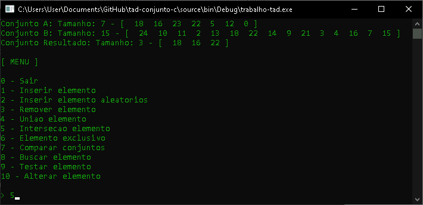

# TAD Conjunto C

Presente repositório segue as orientações de um trabalho acadêmico descrito no arquivo :pencil: `ENUNCIADO.pdf`. Foi feito implementação TAD para conjuntos, incluindo as principais operações: união, interseção e exclusividade.

# Execução

Pré-requisito

- Compilador linguagem C revisão C11 ou superior.

Para maior comodidade está  anexado na pasta ​"source"​ o projeto do repositório na IDE [Code::Blocks](codeblocks.org) em `tad-conjunto-c.cbp`.​​

# Print de Execução

