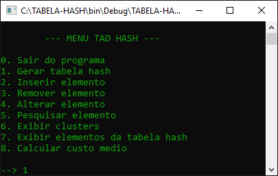
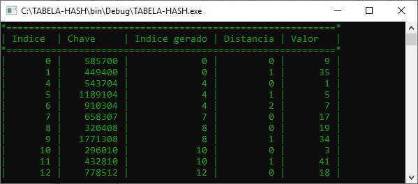
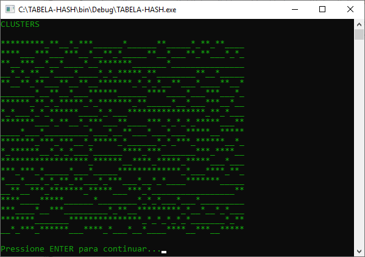
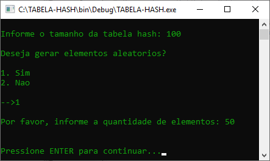

# Tabela Hash C

Trabalho com exemplo de implementação de tabela Hash, calculando custo médio de search miss/insert, também é incluído o CRUD completo. Para mais informações acesso o arquivo :pencil: `ENUNCIADO.pdf`.

# Execução

Pré-requisito

- Compilador linguagem C revisão C11 ou superior.

Para maior comodidade está  anexado na pasta ​"source"​ o projeto do repositório na IDE [Code::Blocks](codeblocks.org) em `tabela-hash-c.cbp`.​​

# Print de Execução

