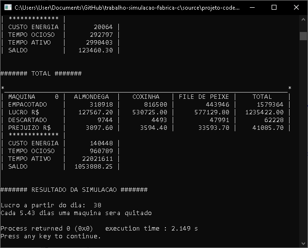

# Trabalho Simulação Fábrica C

O presente repositório é a implementação de um trabalho de simulação da fábrica alimentícia, calculando o lucro/prejuízo sobre a quantidade de máquinas. Para mais informações acesso o arquivo :pencil: `ENUNCIADO.pdf`.

# Execução

Pré-requisito

- Compilador linguagem C revisão C11 ou superior.

Para maior comodidade está  anexado na pasta ​"source"​ o projeto do repositório na IDE [Code::Blocks](codeblocks.org) em `trabalho-simulacao-fabrica-c.cbp`.​​

# Print de Execução

